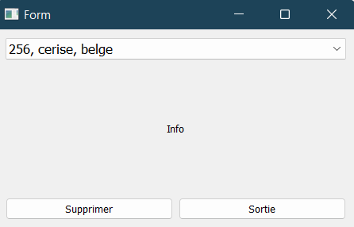
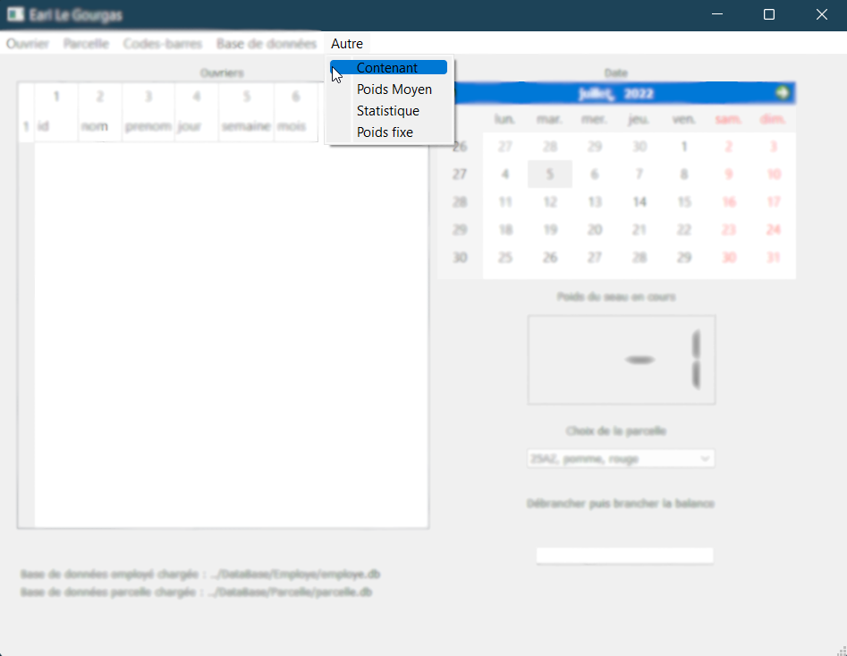

Documentation Logiciel Compteur de Fruit
================================================
---
# 
Sommaire

1. [Explication générale](#Explication_generale)
   1. [Explication des bases de données](#Expliaction_bases_donnees)
   2. [Explication des branchements usb](#Explication_branchements_usb)
   3. [Explication de la fenêtre principale](#Explication_fenetre_principale)
2. [Les différents dossiers générés](#Dossiers_generes)
3. [Première utilisation](#Premiere_utilisation)
4. [Utilisation Courante](#Utilisation_courante)
   1. [Gestion des employes](#Gestion_employes)
      - [Ajouter un employé](#Ajout_employe)
      - [Supprimer un employé](#Supprimer_employe)
      - [Ajouter des jours de travail](#Travail_employe)
      - [Ajouter des jours de repos](#Conges_employe)
      - [Afficher un/plusieurs employé(s)](#Afficher_employe)
   2. [Gestion des parcelles](#Gestion_parcelles)
      - [Ajouter une parcelle](#Ajouter_parcelle)
      - [Modifier une parcelle](#Modifier_parcelle)
      - [Supprimer une parcelle](#Supprimer_parcelle)
      - [Afficher la liste des parcelles](#Afficher_parcelle)
   3. [Gestion des codes-barres](#Gestion_codes_barres)
      - [Création des codes-barres](#Creation_codes_barres)
      - [Remise à zéro des codes-barres](#Reset_codes_barres)
   4. [Gestion des bases de données](#Gestion_base_donnees)
      - [Création d'une base de données](#Creation_base_donnees)
      - [Remise à zéro d'une base de données](#Reset_base_donnees)
   5. [Impression des statistiques](#Impression_statistiques)
      - [Statistiques complètes](#Impression_statistiques_compeletes)
      - [Statistiques simples des employés](#Impression_statistique_employe)
      - [Statistiques simples des parcelles](#Impression_statistique_parcelle)
   6. [Configuration du poids](#Configuration_poids)
      - [Poids moyen](#Poids_moyen)
      - [Poids fixe](#Poids_fixe)
      - [Poids contenant](#Poids_contenant)
   7. [Scan des codes-barres](#Scan_code_barre)
5. [Lors d'une nouvelle saison](#Nouvelle_saison)
6. [Les différents messages affichés](#info)
---
# 
<a name="Explication_generale">Explication générale</a> 

## <a name="Expliaction_bases_donnees">Explication des bases de données</a>
Ce logiciel est un logiciel ayant pour but de sauvegarder les récoltes de chaque employé tout au long 
des différentes saisons. Ces sauvegardes seront effectuées sur des bases de données. Nous aurons une 
base de données pour les employés et une base de données pour les parcelles.
Avant chaque utilisation, il faut s'assurer que des bases de données sont bien chargées dans le logiciel.
On peut le vérifier en regardant en bas à gauche de la fenêtre principale.

## <a name="Explication_branchements_usb">Explication des branchements usb</a>

Les 3 périphériques à utiliser pour utiliser ce logiciel sont les suivants : 
- L'imprimante Zebra ZD421 (obligatoire pour l'impression des étiquettes)
- Le scanner Honeywell voyager 1202g (obligatoire pour le scan des codes-barres)
- La balance Dymo digital USB postal scale M10 (optionnelle pour la pesée des fruits)

Tous les autres périphériques USB n'ont pas été testé avec ce logiciel, il n'est donc pas garantie que 
d'autres périphériques marcheront

---

## <a name="Explication_fenetre_principale"> Explication de la fenêtre principale</a>

Voici la fenêtre principale:

1. Barre des onglets
2. Tableau d'affichage des ouvriers (les infos semaine et mois sont exprimés en seau)
3. Nom des bases de données chargées
4. Calendrier
5. Poids actuellement utilisé
6. Parcelle actuelle et choix de parcelle
7. Information sur la balance
8. Champ d'entrée des codes-barres

# 
<a name="Dossiers_generes">Les différents dossiers générés</a> 

Lors du lancement du logiciel, celui-ci vérifie la présence de 5 dossiers nécessaires au bon fonctionnement
du programme. Si ces dossiers ne sont pas présents, il va les créer.
Ces dossiers sont dans le dossier parents (dossier immédiatement supérieur) du programme.
1. DataBase : Ce dossier contient lui-même trois sous-dossiers
   1. "Employe" et "Parcelle" qui vont contenir les bases de données des employés et des parcelles sous 
   forme: "nom_base.db".
   2. Et un dossier Code_Barre, contenant des fichiers json qui seront de 2 formes:
      1. "id.json" qui contiendra la liste des codes-barres qui auront été imprimés pour l'employe id
      2. "id_used.json" qui contiendra la liste des codes-barres qui ont déjà été scanné 

   ⚠️ **Dans ces dossiers, sont aussi stockées toutes les sauvegardes des bases des saisons passées, il ne faut 
   surtout pas supprimer ce dossier.** ⚠️
2. PDF : Ce dossier sera le dossier de destination des impressions des statistiques (cf. [Impression des statistiques](#Impression_statistiques))

Notre arborescence ressemblera donc à cela:

---

# 
<a name="Premiere_utilisation">La première utilisation</a>

Lors de la première utilisation, suivre ces étapes pour initialiser :
1. Création des bases de données employe et parcelle (cf. [Gestion des bases de données](#Gestion_base_donnees))
2. Création de toutes les nouvelles parcelles (cf. [Gestion des parcelles](#Gestion_parcelles))
3. Création de tous les employés en cours d'activité (cf. [Gestion des employes](#Gestion_employes))

# 
<a name="Utilisation_courante">Utilisation courante</a>

## <a name="Gestion_employe">Gestion des employés</a>

### <a name="Ajout_employe">Ajouter un employé</a>

Pour ajouter un employé, ouvrir l'onglet Ouvrier>Ajouter:

- Rentrer le nom et le(s) prénom(s) de l'employé à enregistrer.
- Cocher un bouton si l'employé est un saisonnier. 
- Si c'est un saisonnier, [ajouter une période de travail](#Travail_employe). 
- Sinon, du travail sera créé automatiquement jusqu'à la fin de l'année.

### <a name="Supprimer_employe">Supprimer un employé</a>

Pour supprimer un employé, ouvrir l'onglet Ouvrier>Supprimer :

- Séléctionner l'employé à supprimer grâce à la liste déroulante.

### <a name="Travail_employe">Ajouter du travail à un employé</a>

Pour ajouter du travail à un employé, ouvrir l'onglet "Ouvrier>Ajouter Travail" :

- Séléctionner l'employé voulu grâce à la liste déroulante. 
- Séléctionner la période de travail de celui-ci.

### <a name="Conges_employe">Ajouter des repos à un employé</a>

Pour ajouter un repos ou des congés à un employé, ouvrir l'onglet "Ouvrier>Ajout Conges".
Ajouter des repos à un employé, permettra de voir afficher -1 sur son bilan de recoltes le jour de son repos, 
ainsi, il sera normal de ne pas avoir eu de résultats de sa part ce jour-ci.

- Séléctionner l'employé voulu grâce à la liste déroulante. 
- Séléctionner la période de repos de celui-ci.

❗ Si on choisit de ne rentrer qu'un seul jour de repos, il faut cocher la petite case sous les dates ❗

### <a name="Afficher_employe">Afficher les employés</a>

####  <a name="Afficher_stat_employe">Afficher les statistiques d'un employé</a>

Pour choisir un employé à afficher, ouvrir l'onglet "Ouvrier>Afficher>Choisir un Ouvrier".

- Séléctionner l'employé voulu grâce à la liste déroulante.

Une fois que nous avons choisi notre employé, nous avons une fenêtre avec ces statistiques qui s'affichent.
On peut choisir d'imprimer ces statistiques (cf. [Impression des statistiques](#Impression_statistiques))

####  <a name="Afficher_list_employe">Afficher la liste des employés</a>

Pour afficher la liste des employés, ouvrir l'onglet "Ouvrier>Afficher>Liste des Ouvriers".

## <a name="Gestion_parcelle">Gestion des parcelles</a>

### <a name="Ajouter_parcelle">Ajouter une parcelle</a>

Pour ajouter une parcelle, ouvrir l'onglet Parcelle>Ajouter.

Cet onglet ouvre une fenêtre qui nous permet de rentrer les informations sur la parcelle.

### <a name="Modifier_parcelle">Modifier une parcelle</a>

Pour modifier une parcelle, ouvrir l'onglet Parcelle>Modifier.

- Choisir la parcelle à modifier grâce à la liste déroulante.
- Choisir le nouveau fruit et la nouvelle variété présente sur la parcelle.

❗ Les deux champs doivent être remplis❗ 

### <a name="Supprimer_parcelle">Supprimer une parcelle</a>

Pour supprimer une parcelle, ouvrir l'onglet Parcelle>Supprimer

- Choisir quelle parcelle voulue grâce à la liste déroulante.

### <a name="Afficher_parcelle">Afficher la liste des parcelles</a>

Pour afficher la liste des parcelles, ouvrir l'onglet Parcelle>Afficher

Cet onglet nous ouvre une fenêtre sur laquelle on a un tableau avec la liste des parcelles.
On peut aussi choisir d'imprimer la liste des parcelles (cf. [Impression des statistiques](#Impression_statistiques))

## <a name="Gestion_codes_barres">Gestion des codes-barres</a>

### <a name="Creation_codes_barres">Création des codes-barres</a>

Pour créer des codes-barres, ouvrir l'onglet Cades-barres>Créer.

- Séléctionner l'employé voulu grâce à la liste déroulante
- Sélectionner le nombre de codes voulus (entre 0 et 200)

### <a name="Reset_codes_barres">Remise à zéro des codes-barres</a>

Remettre à zéro les codes-barres peut servir au début de chaque saison.
Pour faire cela, lancer l'onglet Codes-Barres>Reset

## <a name="Gestion_base_donnees">Gestion des bases de données</a>

### <a name="Creation_base_donnees">Création des bases de données</a>

Au lancement du logiciel, la base de données lancée par défaut et la base la plus récente 
présente dans le dossier DataBase qui n'est pas une base de sauvegarde. 
Pour créer des bases de données, ouvrir l'onglet "Base de données>Creer"

- Choisir le type de base que nous voulons grâce à des boutons.
- Rentrer son nom dans le champ prévu à cet effet. (Si une base du
même nom existe déjà, elle sera chargée dans le logiciel.)
- Le champ adresse complète et le bouton avancé ne seront pas utilisés.

### <a name="Reset_base_donnees">Remise à zéro d'une base de donnée</a>

Remettre à zéro une base de donnée à l'effet suivant :
1. Sauvegarde de la base de donnée dans un fichier nommé : "[nom]_[date du jour]_save.db"
2. Si c'est une base "parcelle" :
   1. Remettre toutes les récoltes à 0
3. Si c'est une base "employé" :
   1. Supprime toutes les tables récolte
   2. Supprime tous les employés saisonniers 

Ouvrir l'onglet "Base de données>Reset"

## <a name="Impression_statistiques">Calcul et impression des statistiques</a>

### <a name="Impression_statistiques_compeletes">Statistiques complètes</a>

Pour accéder à la fenêtre des statistiques, ouvrir l'onglet "Autre>Statistiques"

- Choisir entre employé ou parcelle
- Selectionner le fruit
- Selectionner la variété
- Selectionner une période (optionnel : seulement pour les statistiques "employés")

- Afficher : affiche les statistiques sur l'écran
- Imprimer : écrit un pdf dans le dossier pdf avec les statistiques

### <a name="Impression_statistiques_employe">Statistiques par employé</a>

Pour avoir les statistiques simples par employé
- Effectuer la même manipulation qu'à la section [affichage d'un ouvrier](#Afficher_stat_employe)
- Appuyer sur le bouton imprimer

Cette fonctionnalité sortira un pdf dans le dossier PDF avec le tableau résumant les récoltes de
l'employé.

## <a name="Configuration_poids">Configuration du poids</a>

### <a name="Poids_moyen">Ajout d'un poids moyen</a>

Cette fonctionnalité permet de considérer un poids moyen pour remplacer la pesée des fruits, 
permettant l'accélération de la production.
Pour cela, ouvrir l'onglet "Autre>Poids moyen"

Cette fonctionnalité nous permet de faire une moyenne de poids sur une quantité de seau libre.

- Le chiffre de gauche : poids actuel pesé par la balance
- Le chiffre de droite : poids moyen de tous les seaux déjà comptabilisés
- Ajouter Poids : Permet d'ajouter le poids actuel à la moyenne
- Enregistrer : Enregistre la moyenne actuelle comme poids pour les enregistrements

### <a name="Poids_fixe">Ajout d'un poids fixe</a>

Ajouter un poids fixe permet de toujours utiliser la balance en cas de panne ou de disfonctionnement.
Pour utiliser cette fonctionnalité, ouvrir l'onglet "Autre>Poids fixe"

Le poids fixe est prioritaire sur les autres entrées de poids, ainsi, s'il est activé le logiciel ne prendra 
plus en compte les entrées de la balance.

- Choisir le poids fixe voulu
- Enregistrer 
- Si on veut utiliser de nouveau la balance, cliquer sur désactiver

### <a name="Poids_contenant">Poids du contenant</a>

Permet d'enregistrer le poids du contenant. Ouvrir l'onglet Autre>Contenant

- Choisir le poids du contenant
- Valider

## <a name="Scan_code_barre">Scan des codes barres</a>

Lors de l'enregistrement des seaux :

- Selectionner la parcelle cible
- Cliquer sur la ligne de selection des codes-barres (cf. [fenêtre principale :8](#Explication_fenetre_principale))

# <a name="Nouvelle_saison">Lors d'une nouvelle saison</a>

Pour une nouvelle saison :
- Remettre à zéro les deux bases de données (cela peut prendre un peu de temps)
- Remettre à zéro les listes de codes-barres

